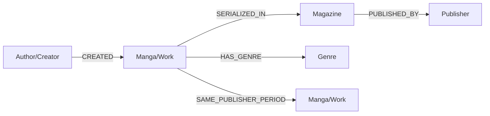

<!-- lead title -->

# GraphRAG
グラフDBで強化したRAGによるLLM生成の実践

- 作者: [sea-turt1e](https://sea-turt1e.github.io/)
- [各種リンク](https://mangagraph.netlify.app/links)

---

## セッション概要と目的

- RAGは非公開データや独自文脈をLLM出力に活かす手法として普及
- しかし従来RAGは「ベクトル検索（非構造化）」や「キーワード検索（構造化）」が中心で、複雑な関係性の表現が苦手
- GraphDBを活用するGraphRAGで「関係性＝構造」をLLMに渡すことで限界を突破
- 本発表は、自作グラフDB「Manga Graph」とMADB（メディア芸術データベース）を使った漫画レコメンドGraphRAGの実装事例を紹介

---

## 2. 従来RAGの課題とGraphRAGの利点

課題（従来RAG）
- ベクトル検索は局所類似に強いが、複数エンティティを跨ぐ関係推論が苦手
- 構造化DBの単純検索は関係の重みや連鎖を表現しづらい

GraphRAGの利点
- ノードとエッジで意味関係を保持し、多段（マルチホップ）推論を支援
- 「作者—作品—雑誌—時期—出版社」など連鎖を踏まえた推薦根拠を提示可能
- LLMへの入力を「選ばれた関係サブグラフ＋要約」にすることで幻覚低減

---

## 3. データセットとモデリング方針（MADB）

データソース
- MADB Lab「メディア芸術データベース」由来の漫画/作者/雑誌等

ノード例
- Work/Manga, Author/Creator, Magazine, Publisher, Staff, Genre, Period

リレーション例
- CREATED, PUBLISHED_IN, SERIALIZED_IN, SAME_PUBLISHER_PERIOD, RELATED_TO

前処理
- タイトル正規化・重複統合、最低巻数フィルタ（n巻以上）、あいまい検索の導入

---

## 3-2. スキーマ設計の例（概略）

属性例（抜粋）
- Work: title, total_volumes, start_year, end_year
- Author: name, active_years
- Magazine: name, period

---

## 3-3. 変換・取り込みのポイント

- タイトル抽出→厳格検索→ヒットなし時はあいまい検索→再厳格検索
- マルチホップ探索は上限（ノード/エッジ数）を設け、LLM入力を制御
- サマライズ（ノード/エッジ内訳・代表例）でプロンプト長を節約

---

## 4. Manga Graph API（抜粋）

使用エンドポイント
- GET /api/v1/neo4j/search（厳格検索、include_related, sort_total_volumes, min_total_volumes）
- GET /api/v1/neo4j/search-fuzzy（あいまい検索: similarity_threshold, embedding_method）
- GET /api/v1/neo4j/creator/{name}
- GET /api/v1/neo4j/stats
- POST /text-generation/generate（LLM推論、SSEストリーミング対応）

補助
- GET /api/v1/media-arts/search-with-related ほか

---

## 4-2. UI/可視化（Streamlitデモ）

- タイトル候補の選択UI（あいまい検索結果から1つを確定）
- 右ペインでGraphRAGの生成結果をSSEで逐次表示
- 取得グラフの要約（ノード/関係数、タイプ別件数、関係サンプル）を展開表示

---

## 5. GraphRAG×LLM 統合フロー

フロー（実装: graphrag_service.py）
1) ユーザ入力
2) タイトル抽出（LLM）
3) 厳格検索 → ヒットなしならあいまい検索 → 再厳格
4) ノード/エッジ整形・要約（タイプ別集計・関係サンプル）
5) GraphRAGプロンプトに挿入（制約・優先度ルール付き）
6) /text-generation/generate にストリーミング要求
7) 推薦文の逐次表示

---

## 5-2. 重要な実装断片（抜粋・擬似コード）

タイトル抽出（LLM最小プロンプト）
- GraphRAGPrompts.get_title_extraction_prompt()
- 出力は1行1タイトルのみ。曖昧なら「不明」

検索の段階的戦略
- strict_search(q, min_total_volumes=5)
- fuzzy_search(q) → best.title → strict_search(best)

グラフ要約の作成
- ノード/エッジ数、タイプ別件数＋代表例、関係サンプル（最大N件）

---

## 5-3. プロンプト設計（推薦）

ポイント（抜粋）
- 入力: user_query, graph_data（整形済み）, context（集計/関係）
- 優先度: 同作者(created) → 同雑誌(published/serialized) → 同出版社×同時期(same_publisher_period)
- 制約: 英語タイトル重複は正規の日本語タイトルを優先／ユーザ指定作品は候補に含めない
- 出力: index付きで5作品、各作品に推薦理由

---

## 6. デモ（比較つき）

操作
- 左: ユーザ入力（作品名）と巻数フィルタ
- 中: 素のLLM（GraphRAGなし）を並走（オプション）
- 右: GraphRAG結果（ストリーミング表示）

比較指標（comparison_service.py）
- 生成成功率、文字数、グラフデータ利用有無、リンク済みエンティティ数

---

## 6-2. デモ想定クエリ（例）

- 「ONE PIECEが好きです。似たような冒険漫画を教えてください。」
- 「NARUTOが好きです。忍者や友情をテーマにした作品を探しています。」
- 「るろうに剣心が好きです。歴史物や剣術をテーマにした作品を教えてください。」

---

## 7. まとめ

要点
- GraphRAGは関係構造をLLMに渡すことで「根拠ある推薦」と「低幻覚化」を実現
- Manga Graph（自作GraphDB）＋MADBで漫画領域に適用し、有効性を確認

今後
- マルチホップ探索の最適化（上限調整/ランキング）
- プロンプト自動最適化、A/B評価指標の追加
- Web UIでの関係可視化強化

---

## 付録A: 主要エンドポイント一覧

- /api/v1/neo4j/search（q, limit, include_related, sort_total_volumes, min_total_volumes）
- /api/v1/neo4j/search-fuzzy（q, limit, similarity_threshold, embedding_method）
- /api/v1/neo4j/creator/{name}
- /api/v1/neo4j/stats
- /text-generation/generate（streaming: trueでSSE）

---

## 付録B: 実行方法（任意）

- Streamlitデモ（比較表示）
	- `streamlit_app.py` を実行
- サンプルスクリプト
	- `sample_with_manga_graph_api.py` のデモ関数

環境
- API_BASE: http://localhost:8000
- OpenAIキーはバックエンドで扱い、フロントからは/ text-generation 経由

---

## 付録C: 参考実装ファイル

- graphrag_service.py（本番UI用のGraphRAGパイプライン）
- prompts/manga_prompts.py（プロンプト各種）
- comparison_service.py（GraphRAG vs 標準LLM比較）
- sample_with_manga_graph_api.py（GraphRAG実装サンプル）
